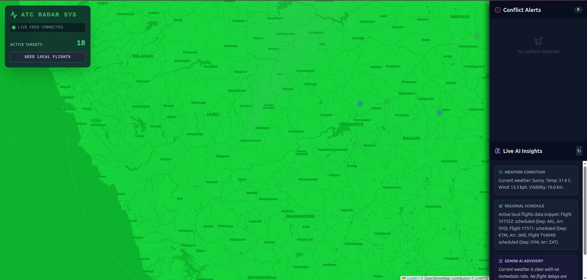

# ✈️ Air Traffic Control (ATC) Simulation System

A real-time, interactive Air Traffic Control simulation built with Next.js and Node.js. This system provides a high-fidelity radar display, live flight tracking, automated conflict detection, and AI-powered flight insights.



## 🌟 Key Features

-   **📡 Real-time Radar Display**: High-performance map interface using Leaflet for tracking simulated aircraft.
-   **⚠️ Conflict Detection**: Automated monitoring system that flags potential mid-air collisions (within 5NM and 1000ft altitude difference).
-   **🤖 AI Insights**: Real-time analysis of flight data, weather conditions, and regional schedules.
-   **⚡ WebSocket Integration**: Low-latency, bi-directional communication between the backend simulation and frontend radar.
-   **🗄️ Persistence**: Flight data and logs stored in MongoDB for consistency and historical analysis.
-   **🌱 Automated Seeding**: Backend automatically seeds realistic flight data if the database is empty.

## 🛠️ Tech Stack

### Frontend
-   **Framework**: [Next.js 15](https://nextjs.org/) (App Router)
-   **Styling**: [Tailwind CSS](https://tailwindcss.com/)
-   **Mapping**: [React Leaflet](https://react-leaflet.js.org/) / [Leaflet](https://leafletjs.com/)
-   **Icons/UI**: Custom CSS-based radar animations & overlays

### Backend
-   **Runtime**: [Node.js](https://nodejs.org/)
-   **Server**: [Express](https://expressjs.com/)
-   **Real-time**: [Socket.io](https://socket.io/)
-   **Database**: [MongoDB](https://www.mongodb.com/) via [Mongoose](https://mongoosejs.com/)

---

## 🚀 Getting Started

### Prerequisites

-   Node.js (v18+)
-   MongoDB (Running locally or via Atlas)
-   A `.env` file in the root directory with:
    ```env
    MONGO_URI=your_mongodb_connection_string
    PORT=8081
    ```

### Installation

1.  **Clone the Repository**:
    ```bash
    git clone https://github.com/Harshith-Daraboina/Aircraft-traffic-control-simulation.git
    cd air-traffic-control-simulation-system-next
    ```

2.  **Setup Backend**:
    ```bash
    cd backend
    npm install
    ```

3.  **Setup Frontend**:
    ```bash
    cd ..
    npm install
    ```

### Running the System

1.  **Start the Backend**:
    ```bash
    cd backend
    node server.js
    ```
    *Note: The backend will automatically seed initial flight data if your database is empty.*

2.  **Start the Frontend**:
    ```bash
    cd ..
    npm run dev
    ```

3.  **Access the Dashboard**:
    Open [http://localhost:3000](http://localhost:3000) in your browser.

---

## 🛰️ Simulation Details

The backend (`server.js`) runs a physics-based simulation loop every 2 seconds:
-   Calculates new positions based on current speed and heading.
-   Introduces minor altitude fluctuations for realism.
-   Performs $O(N^2)$ proximity checks to detect and broadcast "Conflict" statuses to all connected clients.

---

## 📝 License

This project is licensed under the ISC License.
